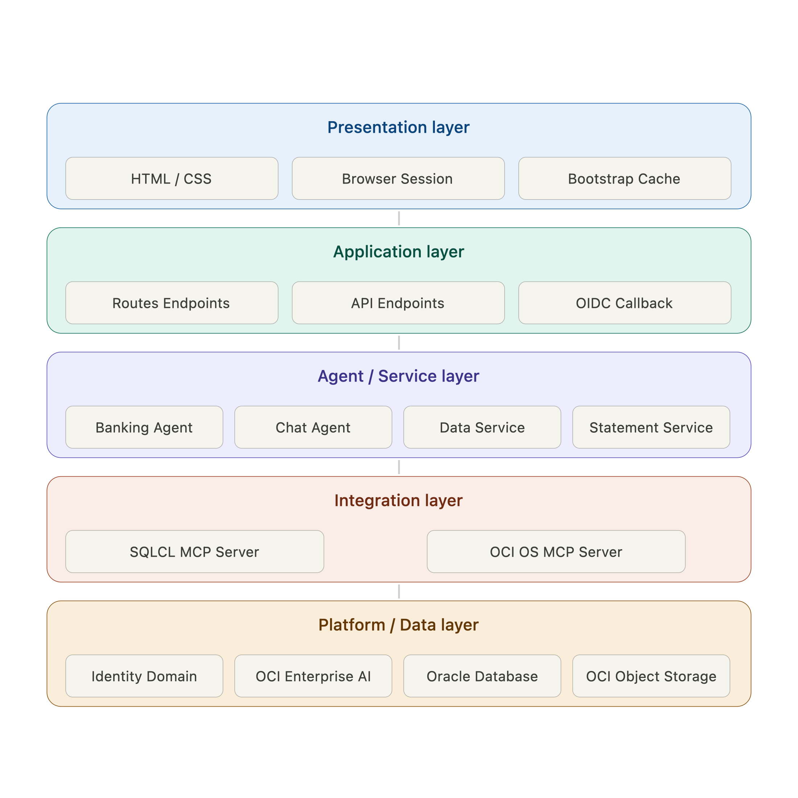
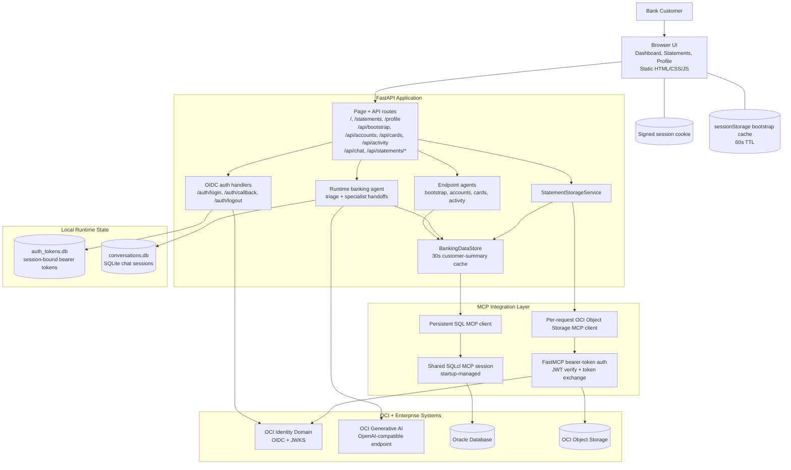

# Agentic Banking Demo Architecture

This document reflects the current implementation in `bankingapplication/`, including the split dashboard APIs, session-backed authentication, persistent chat history, and the authenticated OCI Object Storage MCP path used for statements.

## Layered Architecture Diagram



The diagram above is the current simplified layered architecture view. The editable source is kept in `docs/Agentic_Banking_Architecture.svg`.

## System View



## Layer Breakdown

### 1. Browser Experience

- The frontend is served as static assets from FastAPI and exposes three authenticated pages: dashboard, statements, and profile.
- `static/bootstrap-cache.js` caches `/api/bootstrap` in browser `sessionStorage` for 60 seconds so all three pages can reuse the same customer snapshot.
- The dashboard loads only the initial customer summary first, then lazily fetches accounts, cards, and recent activity through separate APIs when the user opens each tab.
- Chat is browser-driven and keeps a `conversation_id` so multi-turn sessions can resume across requests.

### 2. FastAPI Application Layer

- `main.py` is the central web entrypoint and owns page routing, OIDC redirects, API endpoints, and application lifespan.
- `SessionMiddleware` stores the authenticated browser session and gates access to `/`, `/statements`, `/profile`, and all `/api/*` routes.
- `/api/bootstrap`, `/api/accounts`, `/api/cards`, and `/api/activity` are intentionally separate routes backed by dedicated endpoint agents that call one tool and return structured JSON.
- `/api/chat` runs the customer-facing banking concierge and conditionally adds statement/Object Storage MCP access only when the message looks statement-related.
- `/api/statements/*` routes call the statement service directly instead of routing through the chat agent.

### 3. Agent And Service Layer

- `app/agents.py` defines two different agent patterns:
  - View agents for deterministic page payloads.
  - A triage banking agent with accounts, cards, and payments specialist handoffs for conversational requests.
- The chat agent persists thread state in `conversations.db` through `SQLiteSession`, so the conversation survives across HTTP requests.
- `app/user_context.py` uses a context variable to pass the authenticated user into agent tools and Oracle lookups that execute outside the FastAPI request object.
- `app/data/service.py` is the application-facing data facade. It centralizes Oracle access, outage handling, and a 30-second cache for the customer summary.
- `app/data/statements.py` resolves the current customer from Oracle first, then lists, previews, or generates statement files in Object Storage for that customer.

### 4. MCP Integration Layer

- Oracle data access is shared application infrastructure:
  - FastAPI lifespan builds a shared `MCPServerManager`.
  - `BankingDataStore.start()` binds the persistent SQL MCP client to that manager.
  - SQLcl remains the source of truth for customer, account, card, and transaction data.
- Object Storage access is per-user and per-request:
  - the app reads the logged-in user's stored bearer token,
  - builds an authenticated streamable HTTP MCP client,
  - and uses it only for statement APIs or statement-aware chat turns.
- The Object Storage MCP server uses FastMCP middleware to require a bearer token on every request, validates that token against OCI Identity Domain JWKS, and then performs OCI token exchange before calling Object Storage.

### 5. External Systems And Persistence

- OCI Identity Domain handles browser login and also supplies the JWT verification context for the Object Storage MCP server.
- OCI Generative AI provides the OpenAI-compatible model endpoint used by the Agents SDK.
- Oracle Database stores banking customers, accounts, cards, and transactions.
- OCI Object Storage stores generated and retrieved statement artifacts under:

```text
statements/<customer_id>/<category>/<file>
```

- Local runtime persistence is intentionally separated from the repo source tree:
  - `auth_tokens.db` stores session-bound access tokens for downstream authenticated MCP calls.
  - `conversations.db` stores multi-turn chat history.

## Key Request Flows

### Sign-In And Bootstrap

1. An unauthenticated browser request is redirected to `/login`.
2. `/auth/login` starts the OIDC redirect through OCI Identity Domain.
3. `/auth/callback` stores the user profile in the signed session, persists the latest bearer token in `auth_tokens.db`, and prewarms the cached customer summary in the background.
4. The browser loads `/api/bootstrap`.
5. The bootstrap endpoint runs the dedicated bootstrap view agent, which calls `fetch_bootstrap_view()` once and returns the customer summary plus suggested prompts.
6. The browser caches that bootstrap payload in `sessionStorage` for reuse across dashboard, statements, and profile pages.

### Dashboard Lazy Loading

1. The dashboard renders from the bootstrap payload.
2. When the user opens the Accounts, Cards, or Recent Activity tab, the browser calls `/api/accounts`, `/api/cards`, or `/api/activity`.
3. Each route runs its single-purpose endpoint agent.
4. The endpoint agent reads Oracle-backed banking data through the shared SQL MCP connection and returns JSON for the tab.

### Chat Flow

1. The browser posts a message and `conversation_id` to `/api/chat`.
2. FastAPI binds the authenticated user into the async context.
3. The runtime banking agent loads or creates a `SQLiteSession` in `conversations.db`.
4. The agent always uses OCI Generative AI for reasoning and can use Python function tools for accounts, cards, transfers, and recent transactions.
5. If the message appears statement-related, FastAPI also attaches the authenticated Object Storage MCP client for that turn.
6. The response returns to the browser with the same `conversation_id` for the next turn.

### Statements Flow

1. The statements page reuses the cached bootstrap payload to identify the current customer.
2. `/api/statements/{category}` resolves the customer from Oracle, derives the customer prefix, and lists matching objects from Object Storage.
3. `/api/statements/{category}/content` fetches one object and returns its text payload for preview.
4. `/api/statements/generate-demo` creates monthly, tax, and communications demo files and uploads them to Object Storage for the authenticated customer.

## Current Architecture Decisions

- The home page is optimized for faster first render by splitting bootstrap from accounts/cards/activity.
- SQL access is shared at application startup because it is app infrastructure, while Object Storage access is built per request because it depends on the signed-in user's bearer token.
- Statement APIs bypass the conversational agent when the UI needs deterministic document operations.
- The data service treats Oracle as the system of record and translates integration failures into user-facing banking-data availability errors instead of leaking raw MCP failures.
