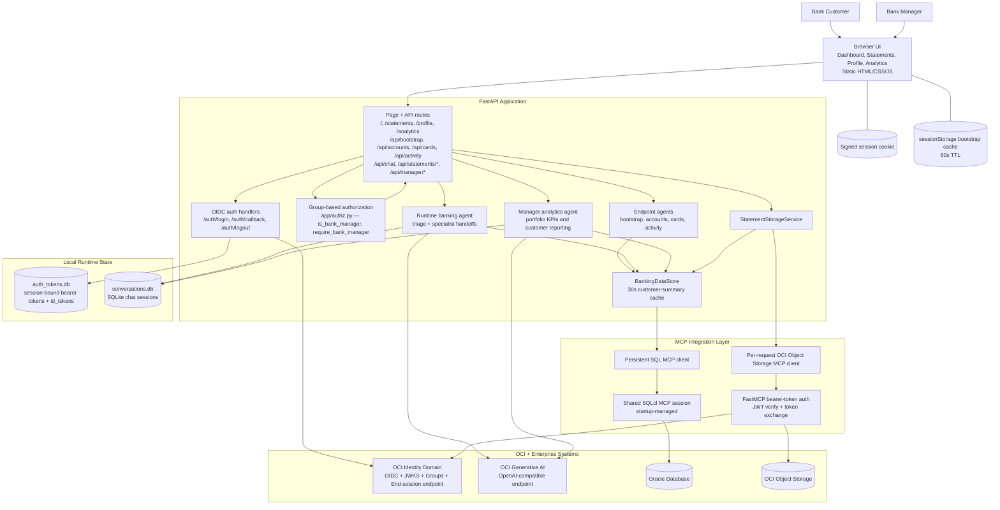

# Agentic Banking Demo Architecture

This document reflects the current implementation in `bankingapplication/`, including the split dashboard APIs, group-based authorization, the Bank Manager Analytics dashboard, session-backed authentication with federated logout, persistent chat history, and the authenticated OCI Object Storage MCP path used for statements.

## Layered Architecture Diagram


The diagram above is the current simplified layered architecture view. The editable source is kept in `docs/Agentic_Banking_Architecture.svg`.

## System View



## Layer Breakdown

### 1. Browser Experience

- The frontend is served as static assets from FastAPI and exposes four authenticated pages: dashboard, statements, profile, and analytics (manager-only).
- `static/bootstrap-cache.js` caches `/api/bootstrap` in browser `sessionStorage` for 60 seconds so all pages can reuse the same customer snapshot.
- `bootstrap-cache.js` also exposes `window.applyManagerNav()`, which calls `/api/auth/roles` (never cached) and shows or hides the `#nav-analytics` link based on the live `is_bank_manager` result.
- The dashboard loads only the initial customer summary first, then lazily fetches accounts, cards, and recent activity through separate APIs when the user opens each tab.
- Chat is browser-driven and keeps a `conversation_id` so multi-turn sessions can resume across requests.
- The Analytics page renders KPI charts using Chart.js 4.4.4, served locally at `static/chart.umd.min.js` to comply with `Content-Security-Policy: script-src 'self'`.

### 2. FastAPI Application Layer

- `main.py` is the central web entry point and owns page routing, OIDC redirects, API endpoints, and application lifespan.
- `SessionMiddleware` stores the authenticated browser session and gates access to all authenticated routes.
- `/api/bootstrap`, `/api/accounts`, `/api/cards`, and `/api/activity` are separate routes backed by dedicated endpoint agents that call one tool and return structured JSON.
- `/api/auth/roles` returns `{"is_bank_manager": true/false}` without caching, so the nav link reflects the current session state immediately after login or role change.
- `/api/chat` runs the customer-facing banking concierge.
- `/api/statements/*` routes call the statement service directly instead of routing through the chat agent.
- `/analytics` and all `/api/manager/*` routes are protected by `require_bank_manager` from `app/authz.py` and return HTTP 403 for non-manager users.

### 3. Authorization Layer

- `app/authz.py` provides group-based access control using OIDC groups stored in the session.
- At login, `/auth/callback` explicitly calls the OCI Identity Domain userinfo endpoint to read group memberships. OCI returns groups as objects (`[{"name": "bank-manager", ...}]`), and the callback extracts the `name` field from each group before storing the list in the session.
- `is_bank_manager(user)` checks whether `"bank-manager"` appears in the session groups list.
- `require_bank_manager` is a FastAPI dependency that raises HTTP 403 if the condition is not met.

### 4. Agent And Service Layer

- `app/agents.py` defines three different agent patterns:
  - View agents for deterministic page payloads (bootstrap, accounts, cards, activity).
  - A triage banking agent with accounts, cards, and payments specialist handoffs for conversational customer requests.
  - A manager analytics agent with five tools for portfolio KPI queries, restricted to manager-only endpoints.
- The chat and manager agents persist thread state in `conversations.db` through `SQLiteSession`, so conversations survive across HTTP requests.
- `app/user_context.py` uses a context variable to pass the authenticated user into agent tools and Oracle lookups that execute outside the FastAPI request object.
- `app/data/service.py` (`BankingDataStore`) is the application-facing data facade. It centralizes Oracle access, outage handling, and a 30-second cache for the customer summary.
- `app/data/oracle_store.py` (`OracleBankingStore`) executes raw SQL against Oracle via the SQLcl MCP session. The manager analytics queries live here alongside the customer-facing queries.
- `app/data/statements.py` resolves the current customer from Oracle first, then lists, previews, or generates statement files in Object Storage for that customer.

### 5. MCP Integration Layer

- Oracle data access is shared application infrastructure:
  - FastAPI lifespan builds a shared `MCPServerManager`.
  - `BankingDataStore.start()` binds the persistent SQL MCP client to that manager.
  - SQLcl remains the source of truth for customer, account, card, and transaction data.
- Object Storage access is per-user and per-request:
  - The app reads the logged-in user's stored bearer token.
  - Builds an authenticated streamable HTTP MCP client.
  - Uses it only for statement APIs or statement-aware chat turns.
- The Object Storage MCP server uses FastMCP middleware to require a bearer token on every request, validates that token against OCI Identity Domain JWKS, and then performs OCI token exchange before calling Object Storage.

### 6. External Systems And Persistence

- OCI Identity Domain handles browser login, supplies the JWT verification context for the Object Storage MCP server, and exposes the `end_session_endpoint` used for federated logout.
- OCI Generative AI provides the OpenAI-compatible model endpoint used by the Agents SDK for both customer and manager agents.
- Oracle Database stores banking customers, accounts, cards, and transactions. The bulk seed script (`db/seed_bulk_1000.sql`) populates 1,000 demo customers for realistic analytics data.
- OCI Object Storage stores generated and retrieved statement artifacts under:

```text
statements/<customer_id>/<category>/<file>
```

- Local runtime persistence is intentionally separated from the repo source tree:
  - `auth_tokens.db` stores session-bound access tokens and id_tokens for downstream authenticated calls and federated logout.
  - `conversations.db` stores multi-turn chat history for both customer and manager agents.

## Key Request Flows

### Sign-In And Bootstrap

1. An unauthenticated browser request is redirected to `/login`.
2. `/auth/login` starts the OIDC redirect through OCI Identity Domain.
3. `/auth/callback` calls the userinfo endpoint to fetch group memberships, extracts `name` from each group object, stores the user profile and groups in the signed session, persists the bearer token and id_token in `auth_tokens.db`, and prewarms the cached customer summary in the background.
4. The browser loads `/api/bootstrap`, which returns the customer snapshot plus an `is_bank_manager` flag derived from the session groups.
5. The browser caches the bootstrap payload in `sessionStorage`. `applyManagerNav()` additionally calls `/api/auth/roles` (uncached) to show or hide the Analytics nav link.

### Dashboard Lazy Loading

1. The dashboard renders from the bootstrap payload.
2. When the user opens the Accounts, Cards, or Recent Activity tab, the browser calls `/api/accounts`, `/api/cards`, or `/api/activity`.
3. Each route runs its single-purpose endpoint agent.
4. The endpoint agent reads Oracle-backed banking data through the shared SQL MCP connection and returns JSON for the tab.

### Chat Flow

1. The browser posts a message and `conversation_id` to `/api/chat`.
2. FastAPI binds the authenticated user into the async context.
3. The runtime banking agent loads or creates a `SQLiteSession` in `conversations.db`.
4. The agent uses OCI Generative AI for reasoning and can call Python function tools for accounts, cards, transfers, and recent transactions.
5. If the message appears statement-related, FastAPI also attaches the authenticated Object Storage MCP client for that turn.
6. The response returns to the browser with the same `conversation_id` for the next turn.

### Analytics Flow (Manager Only)

1. The browser requests `/analytics`. FastAPI calls `require_bank_manager`; non-manager users receive HTTP 403.
2. The analytics page calls `/api/manager/analytics` for the KPI summary and `/api/manager/customers`, `/api/manager/most-active`, `/api/manager/dormant`, and `/api/manager/premium` for tab data.
3. Each manager API route calls `BankingDataStore`, which delegates to `OracleBankingStore` for the appropriate SQL query.
4. Chart.js renders the results as donut and bar charts in the browser.
5. Manager chat messages go to `POST /api/manager/chat`, which runs `run_manager_agent()` with a separate `SQLiteSession`.

### Statements Flow

1. The statements page reuses the cached bootstrap payload to identify the current customer.
2. `/api/statements/{category}` resolves the customer from Oracle, derives the customer prefix, and lists matching objects from Object Storage.
3. `/api/statements/{category}/content` fetches one object and returns its text payload for preview.
4. `/api/statements/generate-demo` creates monthly, tax, and communications demo files and uploads them to Object Storage for the authenticated customer.

### Sign-Out And Federated Logout

1. The browser navigates to `/auth/logout`.
2. FastAPI retrieves the stored id_token from `auth_tokens.db`.
3. FastAPI calls `clear_access_token()` and `request.session.clear()` to destroy local session state.
4. FastAPI fetches OIDC discovery metadata to get the `end_session_endpoint`.
5. FastAPI redirects the browser to `end_session_endpoint?id_token_hint=<token>&post_logout_redirect_uri=<OIDC_POST_LOGOUT_URI>`.
6. OCI Identity Domain terminates the federated session and redirects the browser back to the configured post-logout URI (default `/login`).

## Current Architecture Decisions

- The home page is optimized for faster first render by splitting bootstrap from accounts/cards/activity.
- SQL access is shared at application startup because it is app infrastructure, while Object Storage access is built per request because it depends on the signed-in user's bearer token.
- Statement APIs bypass the conversational agent when the UI needs deterministic document operations.
- Manager API routes reuse the same `BankingDataStore` and `OracleBankingStore` layers as customer routes; access control is enforced at the route level by the `require_bank_manager` dependency.
- The id_token is stored in SQLite rather than the session cookie because JWT id_tokens are typically 1–4 KB and would overflow Starlette's ~4 KB cookie limit.
- Chart.js is served locally rather than from a CDN because the application's Content Security Policy restricts `script-src` to `'self'`.
- The `applyManagerNav()` function calls `/api/auth/roles` rather than reading `is_bank_manager` from the cached bootstrap payload to avoid the 60-second sessionStorage TTL serving a stale value after a role change.
- The data service treats Oracle as the system of record and translates integration failures into user-facing banking-data availability errors instead of leaking raw MCP failures.
