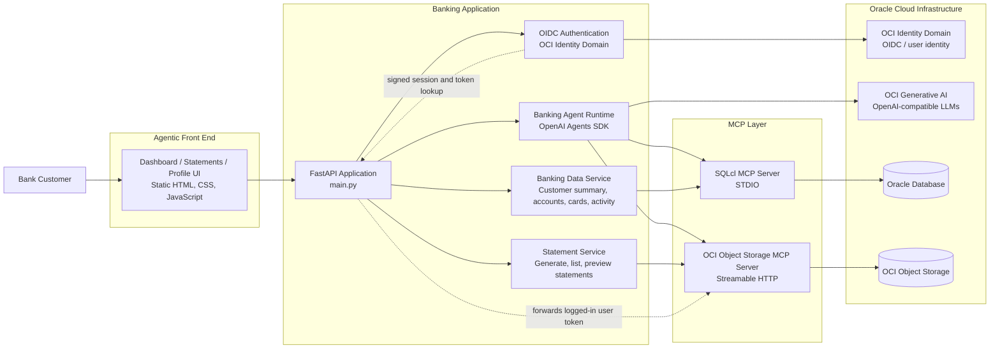

# Architecture Diagram

This diagram captures the current architecture of the Agentic Banking Demo.

## Component View

- The browser UI is an agentic front end with dedicated pages for dashboard, statements, and profile.
- The FastAPI application is the central orchestration layer for authentication, chat, customer snapshot APIs, and statement APIs.
- OCI Identity Domain handles login with OIDC and provides the user identity used to link the signed-in user to banking data.
- The banking agent runs through the OpenAI Agents SDK and uses OCI Generative AI through the OpenAI-compatible endpoint.
- The MCP layer provides controlled access to enterprise systems.
- SQLcl MCP is used to reach Oracle Database for customer, account, card, and transaction data.
- The OCI Object Storage MCP server is used to create, list, and preview statement files stored in Object Storage.
- The FastAPI app forwards the authenticated user's bearer token to the Object Storage MCP server for authorized statement operations.

## Request Flow Summary

### Dashboard load

1. The user signs in through OCI Identity Domain.
2. The browser loads the dashboard.
3. The UI calls `/api/bootstrap` to fetch the customer snapshot.
4. The FastAPI app resolves the signed-in user to a banking customer.
5. The banking data service reaches Oracle Database through SQLcl MCP.
6. The UI renders the customer snapshot and lets the user load additional tabs on demand.

### Chat flow

1. The browser sends a chat message to `/api/chat`.
2. The FastAPI app runs the banking agent.
3. The agent uses OCI LLMs for reasoning and response generation.
4. When needed, the agent uses MCP tools to query Oracle Database or work with Object Storage.

### Statements flow

1. The browser opens the Statements page.
2. The UI calls the statement APIs on the FastAPI app.
3. The statement service talks to the Object Storage MCP server.
4. The Object Storage MCP server uses the forwarded user token and accesses OCI Object Storage.
5. Statements are stored under `statements/<customer_id>/<category>/...`
